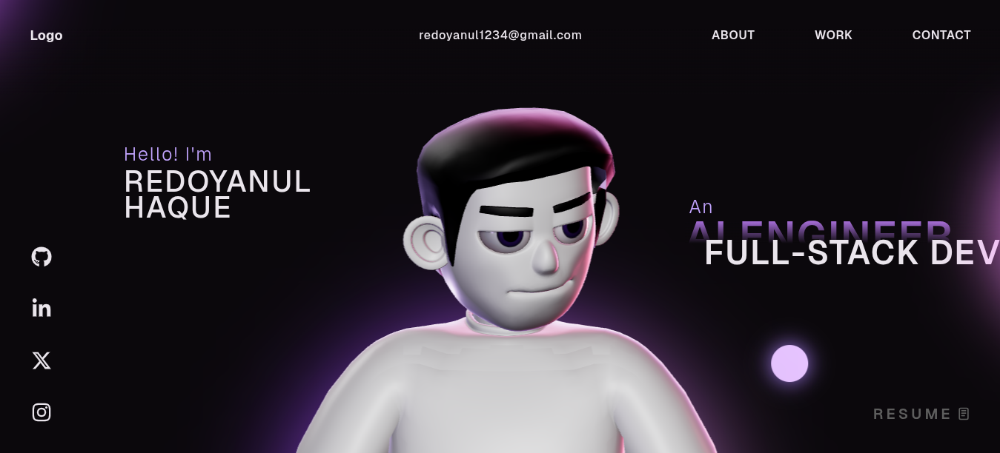
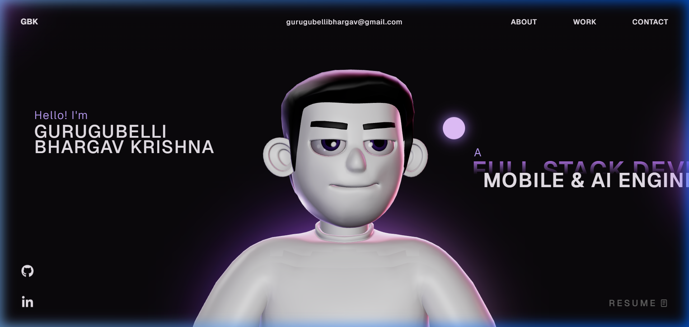
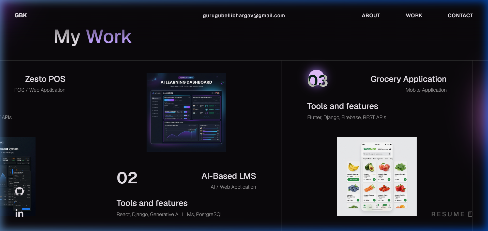
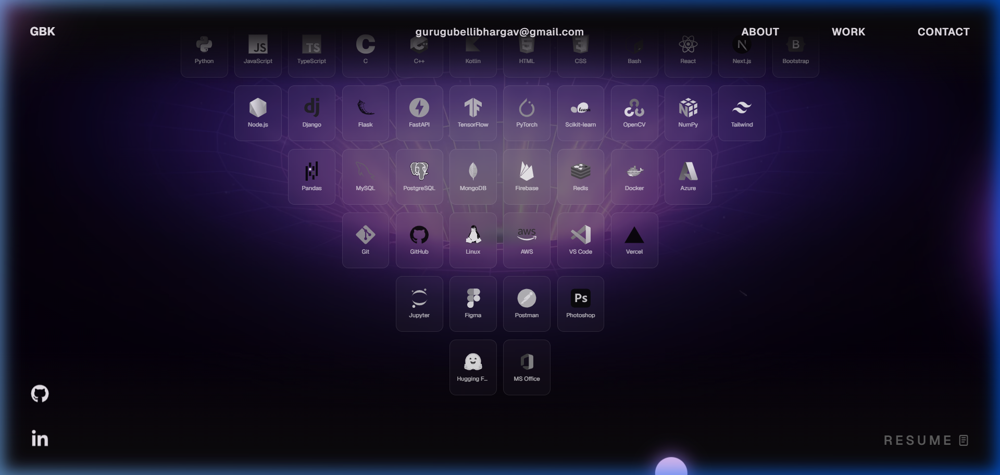

# 🚀 3D Developer Portfolio Website (React + TypeScript + Three.js)

[](https://github.com/bhargavgurugubelli/portfolio-website/stargazers)
[](https://github.com/bhargavgurugubelli/portfolio-website/network/members)
[](LICENSE)
[](CONTRIBUTING.md)

[](./screen-capture%20(13).webm)

A modern, high-performance **3D developer portfolio website** built with **React**, **TypeScript**, **Three.js**, **GSAP**, and **WebGL**.

If you’re a developer looking for a **portfolio template** that feels premium, interactive, and memorable—this repo is for you.

> Live preview: https://bhargavgurugubelli.github.io/portfolio-website/ (or your deployed URL)

---

## 📸 Screenshots

### 🖥️ Hero Section (3D Interactive Workspace)


### 🛠️ Projects Section


### 🚀 Skills & Experience


---

## ✨ Highlights

- **3D / WebGL experience** powered by **Three.js**
- Smooth animations with **GSAP**
- Modern **React + TypeScript** codebase
- Fast, responsive UI (desktop + mobile)
- Designed for developers, engineers, programmers, and creators

---

## 🧰 Tech Stack

- **React**
- **TypeScript**
- **Three.js / WebGL**
- **GSAP**
- **HTML / CSS / JavaScript**

---

## 🚀 Getting Started

### 1) Clone

```bash
git clone https://github.com/bhargavgurugubelli/portfolio-website.git
cd portfolio-website
```

### 2) Install

```bash
npm install
```

### 3) Run locally

```bash
npm run dev
```

### 4) Build

```bash
npm run build
```

---

## 🧩 Customize (Quick Guide)

No need to modify complex WebGL/Three.js code. The portfolio is built to read all configuration details dynamically from a single config file:

1. Open [src/config.ts](file:///c:/Users/gurug/OneDrive/Desktop/portfolio-website-main/src/config.ts).
2. Edit the `config` object to update:
   - **Personal info & bio**: Name, Title, and Description.
   - **Professional experiences**: Company name, period, role, and technologies.
   - **Projects list**: Titles, tech stack used, images, and descriptions.
   - **Social links & Contact details**: GitHub, LinkedIn, email.
   - **Core skill categories & tools list**.
3. Replace the project showcase images inside the `public/images/` directory with your own.

---

## 🌟 Community Showcase

Have you customized and deployed this template for your own developer portfolio? Show it off here!

To add your site:
1. Fork this repository.
2. Add your name and deployed website link to the list below.
3. Submit a Pull Request with the title `chore: add [Your Name] to showcase`.

*No entries yet. Be the first to add yours!*

---

## 🤝 Contributing

Contributions of all sizes are welcome! Please read [CONTRIBUTING.md](CONTRIBUTING.md) for instructions on running locally, coding standards, and how to submit a PR.

---

## ⭐ Support

If you found this template helpful, please consider:
- Giving the repository a **Star** ⭐ (it helps others discover it!)
- Forking the repository and sharing your version.
- Sharing it on social media or with friends.

---

## 🤝 Connect

- LinkedIn: [Bhargav Krishna](https://www.linkedin.com/in/bhargavgurugubelli-b2938a212)
- GitHub: [@bhargavgurugubelli](https://github.com/bhargavgurugubelli)

---

## 🏷️ Recommended GitHub Topics (add in repo settings)

Add these topics to improve GitHub search visibility:

`portfolio` `developer-portfolio` `portfolio-website` `portfolio-template` `3d-portfolio` `react` `typescript` `threejs` `webgl` `gsap` `frontend` `vite` `open-source`

---

## 🪪 License

This project is open source and available under the **MIT License**. See [LICENSE](LICENSE).
